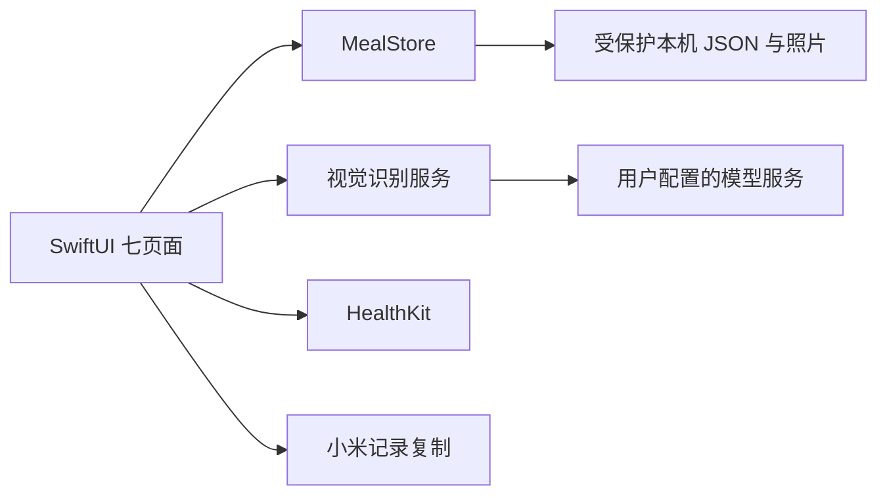

# 轻食记 V2 — PRD

执行状态更新（2026-10-01）：已初始化 Git 并上传用户授权的公开仓库 Sunshine-D/i-sport。[首次云端构建](https://github.com/Sunshine-D/i-sport/actions/runs/36850506933)通过24项预览领域测试、7项 Swift 测试、模拟器与未签名设备编译（Xcode 26.6 / SDK 26.5）。文中编译未运行的初始记录已被本次证据更新；相机、真实模型、HealthKit、iOS 27 与签名安装验收仍未完成，整体仍为 PARTIAL。

日期：2026-10-01。Complexity: 9 → HIGH mode（10+ 文件 +3，新系统 +2，状态逻辑 +2，持久化 +1，外部接口 +1）。用户已授权文档后直接开发，不设置常规确认节点。初始开发时目录无 Git 仓库，采用本机顺序实施与可复查的检查证据；2026-10-01 已按用户授权初始化 Git 并上传公开仓库 Sunshine-D/i-sport。未运行 Linchpin 模型子进程流水线。

## Context

个人使用约束更新：用户仅自用，以 iPhone 为主；暂停 App Store / TestFlight 交付路线，优先验证免费账号侧载。额外提供编译关闭 HealthKit 的基础自用构建，用于先验证安装与餐食核心功能；另行保留完整健康版。免费签名和 iOS 27 真机兼容性仍待验证，不能据此撤销健康、小米或多端同步需求。操作说明见 SELF-USE.md。

设备约束补充：用户没有 Mac，有 iPhone 和 iPad；后续采用云端 macOS 编译与签名分发路线，不要求购买 Mac。已准备未签名手动构建配置与局域网交互预览；签名和 TestFlight 分发尚未实现，具体见 NO-MAC.md。

用户需要在 iOS 27 上拍照估算每种食物和整餐热量，查看饮食历史，结合小米运动数据管理摄入，并尽可能自动写入小米减重餐食模块，无自建业务服务器。输入基准：design/用户设计-V2-主要页面.png、design/用户设计-V2-我的.png 和 design/用户设计-V2-基准说明.md。已有目录只有设计文档与图片，无代码或被替换的旧实现。

## Solution

SwiftUI 原生应用；本机原子 JSON 数据库与受保护的照片文件；HealthKit 用户主动授权后的健康数据读取/饮食写入；URLSession 直连用户配置的 HTTPS 视觉大模型；Security 钥匙串保存个人密钥。浏览器提供界面与领域流程预览，严格标记演示识别，不替代原生功能验收。

页面保留五个底部入口：今日、日记、中央拍照、趋势、我的；数据同步为我的二级页面。橙色摄入、绿色消耗、浅灰紫背景、白色圆角分组。分析结果包含 kcal 与三大营养素；营养素未知时显示缺失，不默认为测量到的零值。

需求优先级：P0 拍照/相册、真实视觉请求、分项确认编辑、本机历史、失败重试、手动记录；P1 日期与趋势、健康读取/写入、导出；待外部验证 小米每餐写入、完整历史 iCloud、多端、端侧离线视觉。

明确外部能力缺口：无凭据不发送网络请求；未接通小米不显示成功；不上传个人饮食历史到 CloudKit；不把浏览器演示或返回 HTTP 200 视为营养识别实测成功。

## Integration Ledger

| # | New thing | Live caller (`file:line`, non-test) | Replaces | Old path removed? | Negative control |
|---|-----------|-------------------------------------|----------|-------------------|------------------|
| 1 | Meal / FoodItem 校验与摄入合计 | ios/LightMeal/Views/CaptureView.swift:43 | 无 | 新项目 | Swift 测试待执行；预览比例突变已观察红灯 |
| 2 | MealStore 本机持久化 | ios/LightMeal/App/LightMealApp.swift:4；Views/CaptureView.swift:106 | 无 | 新项目 | 损坏时禁止覆盖；原生持久化真机控制待验证 |
| 3 | VisionRecognitionService | ios/LightMeal/Views/CaptureView.swift:97 | 无 | 新项目 | 畸形响应解析测试已提供；真实服务待配置验证 |
| 4 | HealthService | ios/LightMeal/Views/CaptureView.swift:107 | 无 | 新项目 | 关闭授权不写入；真机状态控制待验证 |
| 5 | 七页面导航 | ios/LightMeal/App/LightMealApp.swift:8；App/RootView.swift:58 | 旧概念布局仅文档 | 文档由 V2 取代 | 浏览器核心表单失效已观测并修复；原生导航待编译 |
| 6 | 浏览器领域预览 | preview/app.mjs:1 | 无 | 辅助预览 | 临时禁用比例计算：24 项中4项失败 |
| 7 | Xcode 工程生成器 | README.md:18；scripts/check-project.py:14 | 无 | 新项目 | 缺失 Swift 源文件检查 exit 1 |
| 8 | 小米每餐/iCloud/端侧视觉 | optional/unbuilt: 外部权限、审核与 SDK/真机验证未完成 | 无 | 未建，不模拟成功 | 不可用状态不可成为成功 |

## Execution Phases

### Phase 1: 原生入口与本机餐食
**Files (5):**
- `ios/LightMeal/Core/Meal.swift` - NEW: 食物校验、合计、导出模型
- `ios/LightMeal/Core/MealStore.swift` - NEW: 本机原子保存、恢复、设置
- `ios/LightMeal/App/LightMealApp.swift` - NEW: 原生入口
- `ios/LightMeal/App/RootView.swift` - NEW: 导航与公共视觉组件
- `README.md` - EDIT: 启动和运行说明

用户可从今日进入记餐与日记。调用链 App → RootView → MealStore。核心测试在 Phase 5 执行；原生测试命令为 `cd ios && swift test`，Windows 无 Swift 时记录 NOT RUN。

### Phase 2: 拍照与真实视觉分析
**Files (5):**
- `ios/LightMeal/Services/RecognitionService.swift` - NEW: HTTPS 视觉识别与解析
- `ios/LightMeal/Services/KeychainStore.swift` - NEW: 密钥隔离
- `ios/LightMeal/Views/CaptureView.swift` - NEW: 相机/相册/手动/结果确认
- `ios/LightMeal/Views/PhotoPicker.swift` - NEW: UIKit 相机桥接
- `ios/LightMeal/App/RootView.swift` - EDIT: 相机流程入口

用户选择照片、同意发送到配置服务后得到可编辑结果。失败保留照片，重试不重复保存。真实模型和相机需 Mac/iPhone 验证；URLSession 和解析检查不能代替实测。

### Phase 3: 日记、编辑与趋势
**Files (5):**
- `ios/LightMeal/Views/TodayView.swift` - NEW: 环图、消耗、餐食摘要
- `ios/LightMeal/Views/DiaryView.swift` - NEW: 日期与餐食详情编辑/删除
- `ios/LightMeal/Views/TrendsView.swift` - NEW: 按实际记录聚合
- `ios/LightMeal/Views/FoodEditor.swift` - NEW: 克重、比例与营养编辑
- `ios/LightMeal/App/RootView.swift` - EDIT: 接入真实页面

验收已保存餐能从今日与日期日记找回，修改实际摄入更新所有合计；没有记录的日期不是零摄入。

### Phase 4: 健康与设置
**Files (4):**
- `ios/LightMeal/Services/HealthService.swift` - NEW: HealthKit 读取与幂等写入
- `ios/LightMeal/Views/SettingsView.swift` - NEW: 我的、数据来源、服务配置、导出
- `ios/LightMeal/Core/MealStore.swift` - EDIT: 独立外部状态与重试数据
- `ios/LightMeal/App/RootView.swift` - EDIT: 健康服务环境

用户授权后读取实际数据、保存后可选写膳食能量。小米提供复制，不宣称自动导入。所有系统外部功能验收均保留真机门槛。

### Phase 5: 工程与原生测试
**Files (5):**
- `scripts/generate-project.py` - NEW: 标准库生成可打开的 Xcode 工程
- `ios/Package.swift` - NEW: 纯 Swift 领域测试入口
- `ios/Tests/MealTests.swift` - NEW: 份量、合计、解析、去重测试
- `scripts/check-project.py` - NEW: 配置/源文件/权限检查
- `README.md` - EDIT: 编译检查与能力边界

工程生成产物：ios/LightMeal.xcodeproj/project.pbxproj、共享 scheme、Info.plist、entitlements、Assets.xcassets 配置。项目检查证明完整性，不证明 Swift 编译通过。

### Phase 6: 可运行交互预览
**Files (5):**
- `preview/index.html` - NEW: 本机预览入口
- `preview/style.css` - NEW: V2 视觉规范
- `preview/core.mjs` - NEW: 校验、合计、去重、导出与趋势
- `preview/app.mjs` - NEW: 七页面和编辑保存流程
- `README.md` - EDIT: 明确演示与原生界限

只测试真实本机交互，演示结果显式标记；不在浏览器虚构 HealthKit、小米和 iCloud 接通。

### Phase 7: 验证与交付
**Files (5):**
- `scripts/preview-server.mjs` - NEW: 本机静态预览，不是业务后端
- `tests/core.test.mjs` - NEW: 对实际预览领域模块执行测试
- `scripts/negative-control.mjs` - NEW: 临时副本突变验证测试有效性
- `docs/VERIFICATION.md` - NEW: 命令、结果、缺口与续跑方式
- `docs/PRD.md` - EDIT: 实际调用行与验收状态

## Negative Controls

以下负向控制已实际执行，日志见 docs/evidence。原生和外部能力没有获得相同运行证据，维持未完成状态。

| Gate | Negative control | Expected red | Exact command/result |
|---|---|---|---|
| preview-domain | 临时禁用实际摄入比例运算 | 领域断言失败 | command: node scripts/negative-control.mjs; result: RED observed: consumed fraction disabled; exit: 1 |
| project-integrity | 添加缺失工程源码引用 | 检查器报告缺文件 | command: python scripts/check-project.py --negative; result: RED observed: Missing referenced source: LightMeal/App/Missing.swift; exit: 1 |

## Acceptance Criteria

- [ ] 原生用户拍照/选图，经真实模型返回分项结果，可调整份量后保存。
- [ ] 原生用户重启后仍能找到餐食，编辑删除同步更新今日和趋势。
- [ ] 拒绝权限/网络失败仍可手动记餐，无重复项或虚假成功。
- [ ] 用户授权后可见真实运动数据，并将自己的膳食能量写入 Apple 健康。
- [x] 按 V2 七页面结构提供可运行预览，完成手动记录/样例→编辑→保存→历史流程（演示照片识别完整重试另列未验）。
- [ ] 小米自动写入、CloudKit 多端和端侧视觉实际验证（外部阻塞，不能勾选）。

## Checkpoint Protocol

每阶段检查实际调用链与错误路径；运行可用测试，记录准确命令与退出码。预览领域与工程完整性分别执行正常和负向检查。Swift 测试、Xcode 编译、HealthKit 真机与真实模型实测缺少环境时明确 NOT RUN，不降低验收标准，不声称完整交付。

## Verification Evidence

Contract conformance: prd_contract: v1；合同结构检查返回 CONFORMING。领域 24/24；比例突变4项失败 exit1；工程结构检查通过，缺失源码控制 exit1。浏览器已验证编辑457→341、刷新恢复、手动记餐和各入口。Swift / Xcode 当前不可用，所有原生验收未勾选。完整日志、运行缺口与续跑入口见 docs/VERIFICATION.md。整体 PARTIAL，不把代码生成称作全部验收完成。
